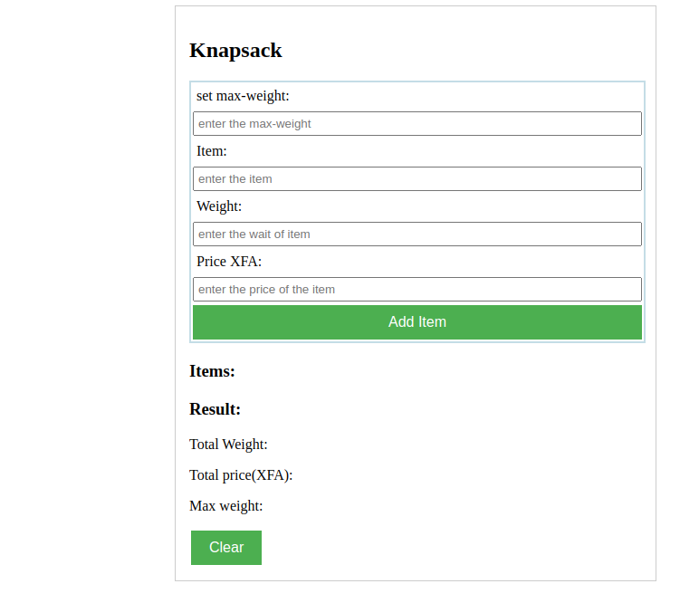

# knapsack

This project is named knapsack.

## APP

## ABOUT

This page is built for interaction with the user. it enables
the user to input some items in a bag. The weight of  the items
are automatically sum inorder not to exceed the maximum weight of the bag

## Built With

- HTML
- CSS
- JavaScript
- Google Chrome

## Clone project

- To get a local copy up and running follow these simple example steps.
- Clone this repository with
`https://github.com/MALWICK/knapsack/pulls` using your terminal.
- Change to the project directory by entering: cd wedding in the terminal.

## Command-line steps

- $ git clone `$ https://github.com/MALWICK/knapsack/pulls`
- $ `cd knapsack`
- $ `git checkout feature/design`

## Start App

- run any browser(google chrome, safari)

## Prerequisites

Knowledge about:

- HTML
- CSS
- JS
- Google Chrome

## Live Site

[Link]( https://malwick.github.io/knapsack/)

## Author

👤 **MALWICK**

- GitHub: [@MALWICK](https://github.com/MALWICK)

## 🤝 Contributing

Contributions, issues, and feature requests are welcome!

Feel free to check the [issues page](https://github.com/MALWICK/knapsack/issues).

## Show your support

Give a ⭐️ if you like this project!